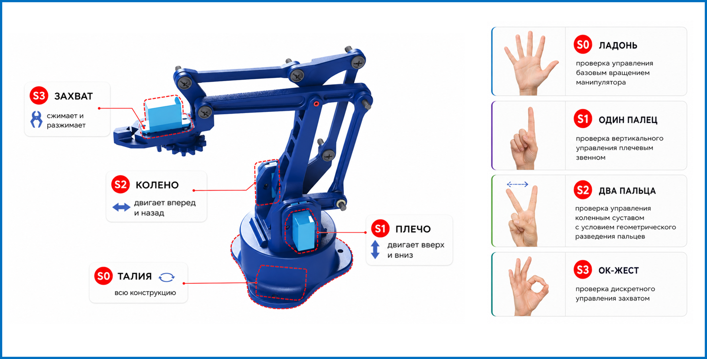

# Индустриальный манипулятор

<p align="center">
  
</p>

<p align="center">
  
  
  
  
  
  
</p>

<p align="center">
  Прототип системы управления манипулятором с помощью компьютерного зрения
</p>

---

## О проекте

Программа позволяет управлять манипулятором в реальном времени с помощью жестов руки(кисти), распознаваемых через камеру библиотекой **MediaPipe**. Команды передаются на аппаратную часть через **Arduino** по последовательному порту.

> ⚠️ Проект находится в активной разработке с **25 марта 2026 года**.

---

## Возможности

| Функция | Описание |
|---|---|
|  Жестовое управление | Распознавание жестов руки через MediaPipe |
|  Подключение устройств | Arduino по COM-порту, выбор камеры по индексу |
|  Emergency Stop | Мгновенная остановка всех сервоприводов |
|  Журнал событий | Лог всех жестов и команд с временными метками |
|  Гибкая настройка | Маппинг жестов, скорость, чувствительность, разрешение |

---

## Страницы приложения

### Home — Центр управления подключением
Стартовая страница. Отображает статус всех устройств и позволяет запустить систему одной кнопкой.

```
🟢 Arduino (COM)   🟢 Camera (0)   🟡 MediaPipe 
```

###  Control — Управление
Основная рабочая страница. Видеопоток с overlay жеста и команды.

###  Settings — Настройки
Конфигурация Arduino, камеры .

###  Logs — Журнал
Таблица всех событий с фильтрами по времени и типу команды, экспорт в CSV.

### В РАЗРАБОТКЕ : Maunal - Инструкция пользователя. Пользовательская инструкция пользоания системой.

---

## Жесты и команды

| Жест | Команда |
|---|---|
| Ладонь |  Вращение конструкции (S0) |
| Один палец | Плечо вверх, вниз (S1) |
| Разведение двух пальцев | Колено вперед, назад (S2) |
| ОК  | Сжать, разжать (S3) |

---

## Требования

- Python 3.10+
- Arduino с прошивкой для управления сервоприводами
- Веб-камера (720-1080p)
- Зависимости: `mediapipe`, `opencv-python`, `pyserial`, `PyQt6`, `pillow`

---

## Установка и запуск

```bash
# Клонировать репозиторий
git clone <repo-url>
cd <repo-folder>

# Установить зависимости
pip install -r requirements.txt

# Запустить приложение
python main.py
```

---

## Состояния системы

| Состояние | Описание |
|---|---|
| `IDLE` | Система ожидает запуска |
| `CONNECTING` | Идёт подключение устройств |
| `RUNNING` | Система работает в штатном режиме |
| `ERROR` | Обнаружена ошибка, работа невозможна |

---
