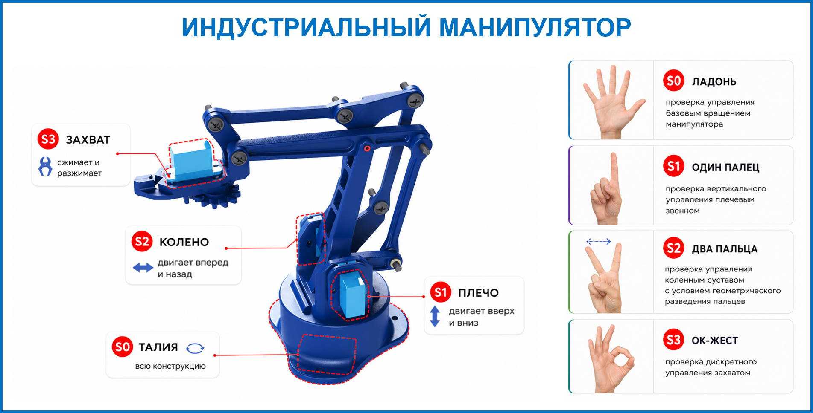
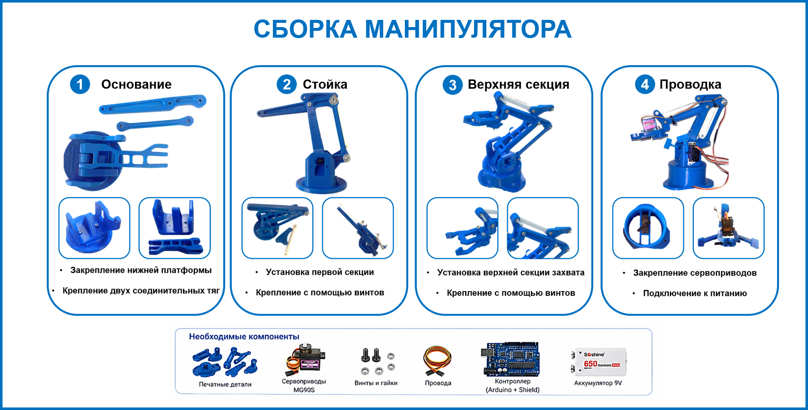

# ИНДУСТРИАЛЬНЫЙ МАНИПУЛЯТОР v.0.0.1

  

  
  
  
  
  
  

---

## О проекте

Программа позволяет управлять манипулятором в реальном времени с помощью жестов руки(кисти), распознаваемых через камеру библиотекой **MediaPipe**. Команды передаются на аппаратную часть через **Arduino** по последовательному порту.

> ⚠️ Проект находится в активной разработке с **25 марта 2026 года**.

---

## Сборка Манипулятора

  

## Статус разработки Сост

Проект находится в активной разработке. Функционал и интерфейс могут изменяться.  
